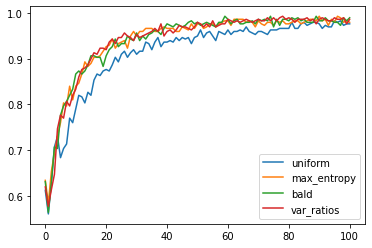
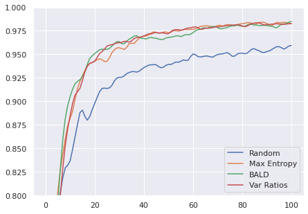

# Deep Bayesian Active Learning with Image Data
Implementation of "[Deep Bayesian Active Learning with Image Data](https://arxiv.org/pdf/1703.02910.pdf)" by Yarin Gal, Riashat Islam, Zoubin Ghahramani (ICML 2017) using Pytorch.

## About The Paper
In this paper, Gal _et al._ combine recent advances in Bayesian deep learning into the active learning framework in a practical way -- an active learning framework for high dimensional data, a task which has been extremely challenging so far. 

By taking advantage of specialised models such as Bayesian convolutional neural network, the proposed technique obtains a significant improvement on existing active learning approaches.
### Methodology
Compare various acquisition functions: Bayesian Active Learning by Disagreement (BALD, _[Houlsby et al., 2011](https://arxiv.org/pdf/1112.5745.pdf)_),Variation Ratios (_[Freeman, 1965](https://academic.oup.com/sf/article-abstract/44/3/455/2228590?redirectedFrom=fulltext)_), Max Entropy (_[Shannon, 1948](http://people.math.harvard.edu/~ctm/home/text/others/shannon/entropy/entropy.pdf)_) and baseline Random relying on Bayesian CNN uncertainty with simple image classification benchmark. All acquisition functions are assessed with _same_ model structure:

> Convolution-relu-convolution-relu-max pooling-dropout-dense-relu-dropout-dense-softmax

> With **32** convolution kernels, **4x4** kernel size, **2x2** pooling, dense layer with **128** units and dropout probabilities **0.25** and **0.5**. 

All models are trained on MNIST dataset with random initial training set of 20 datapoints and a validation set of 100 points on optimised weight decay. A standard test set of 10K is used and the rest of the points are used as pool set. The test error of each model and each acquisition function is assessed after each acquisition using dropout approximation at test time. 

Monte Carlo dropout is used to decide which datapoints to query next. Repeat the acquisition process for 100 times and acquiring 10 points that maximise the functions for each time. (Total acq points=1000)

## Getting Started
This repo consists of 4 experiments conducted in the paper which are:
1. Comparison of various acquisition functions
2. Importance of model uncertainty
3. Comparison to current active learning technqiues with image data (Minimum Bayes Risk, MBR)
4. Comparison to semi-supervised learning
### Prerequisites
- Python 3.5 or later

In Ubuntu, you can install Python 3 like this:
```bash
$ sudo apt-get install python3 python3-pip
```
For Windows and MacOS, please refer to https://www.python.org/getit/.

### Installation
Use ```pip3 install -r requirements.txt``` to install:
- pytest (for testing)
- modAL (modular active learning framework for Pytorch)
- skorch (a scikit-learn wrapper for Pytorch)
- pytorch
- numpy
- matplotlib
- scipy
- scikit-learn

### Pytest Test Suite
1. To run test:
```bash
$ pytest
```

### Launch
Run
```bash
$ python3 main.py --batch_size 128 \
                  --epochs 50 \
                  --lr 1e-3 \
                  --seed 369 \
                  --experiments 3 \
                  --dropout_iter 100 \
                  --query 10 \
                  --acq_func 0 \
                  --val_size 100
```
Or use ```--help``` for more info.

Note: ```val_size``` is set to be 100 for Experiment 1. To run Experiment 4, please set this value to 5000.

## Results
### 1. Comparison of various acquisition functions


Number of acquired images to get model error of %: (the lower the better)
| Techniques | 10% error (Paper: Keras) | 10% error (Experiment: Pytorch) | 5% error (Paper: Keras) | 5% error (Experiment: Pytorch) |
|  :------:  |   :------:   |   :------:   |   :------:   |   :------:   |
| Random (Baseline) | 255 | 250 | 835 | 517 |
| BALD | 145 | 150 | 335 | 296 |
| Var Ratios | 120 | 143 | 295 | 283 |
| Max Entropy | 165 | 163 | 355 | 310 |

Best 2 models: Var Ratios, BALD

### 2. Importance of model uncertainty

### 3. Comparison to current active learning techniques

### 4. Comparison to semi-supervised learning


Test error on MNIST with 1000 acquired images, using 5000 validation points:
| Technique | Test error (Paper: Keras) | Test error (Experiment: Pytorch) |
|  :-----:  |   :----:   |   :----:   |
| Random(Baseline) | 4.66% | 3.73% |
| BALD | 1.80% | 1.81% |
| Max Entropy | 1.74% | 1.66% |
| Var Ratios | 1.64% | 1.57% |

Best 2 models: Var Ratios, Max Entropy

## Acknowledgements
1. https://github.com/Riashat/Deep-Bayesian-Active-Learning
2. https://github.com/damienlancry/DBAL 
3. https://github.com/modAL-python/modAL/blob/master/examples/pytorch_integration.py